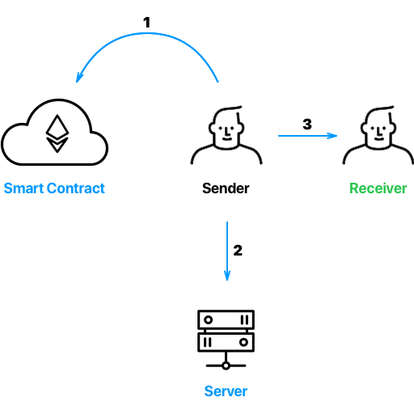
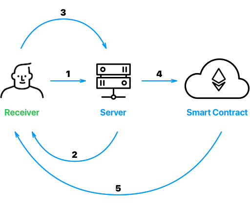

# Linkdrop Webapp

## Overview

Linkdrops allows to send ether and tokens to anyone even without Ethereum wallet. The receiver will get the special link and be verified using phone number. The only requirement for you as a sender to have the Web3 compatible Ethereum wallet with sufficient balance and the phone number of the person you are willing to send ether to. You will need to share a special message with the receiver with the link containing all the instructions, following which he or she will download the wallet \(or use existing one\) and receive assets to it.

## MVP

You can play with beta at [https://eth2.io](https://eth2.io). The App supports Ethereum Main and Ropsten Test networks right now.

## Video

* [Sending demo](https://www.youtube.com/watch?v=FeqQyFrmptA)
* [Receiving demo](https://www.youtube.com/watch?v=qp3kkXKIHP8)

## Transfer details

### Send

 1. Sender generates transit private-public key pair, deposits ether to Escrow Smart Contract and assigns transit public key to the deposit. On withdrawal Escrow Smart Contract verifies that receiver's address is signed by the transit private key. 2. Sender encrypts transit private key with random secret code and sends encrypted transit private key to verification server. 3. Sender passes the secret code to receiver by the way he chooses \(voice, sms, e-mail, etc.\)

### Receive

 1. Receiver types in his phone number and the secret code. Hashed phone verification request is sent to server. \(So not at any point in time verification server has the transit private key.\) 2. Server sends the verification code via SMS to the phone entered. 3. Receiver gets the code from SMS and types it in. If the code is correct, server returns encrypted transit private key to receiver. 4. Receiver decrypts the transit private key with the secret code provided by sender and gets the transit private key. Receiver signs address of his choice with the transit private key. Receiver sends signed address to verification server. 5. Verification server tries to withdraw ether from Escrow Smart Contract to signed address. If signature is correct, the transaction is executed and receiver gets the ether.

## Running on Ropsten or Mainnet

Works best with [Trust Wallet](http://trustwalletapp.com) on mobile. You can also use a Desktop Browser with installed Metamask or any Web3 compatible browsers. Go to [https://eth2.io](https://eth2.io) to use the App.

## Code structure

`./src` - all Javascript/React code is located in this folder.

`./src/services/eth2phone/index` - all interaction of the web app with the Escrow Smart Contract and Verification Server is defined in this file.

`./contracts/e2pEscrow` - the Escrow Smart Contract, which locks ether from sender and withdraws ether on request from the owner to address signed by transit private key. Verification Server deploys the contract and controls Smart Contract's owner account.

`./test` - tests for the Escrow Smart Contract

This repo contains Front-End code + Smart Contracts. Verification Server's code is located in the separate [repository](https://github.com/Eth2io/eth2-server)

## Branch naming conventions

"master" branch - our stable prod branch. We use it to deploy current stable version of application
"dev" branch - our staging branch. We use it to deploy current testing version with new features before merging to "master" branch

How to work as an contributor to Linkdrop Monorepo:
1. When you want to work with an issue your branch naming process should include next steps:
* find an issue id (can be found in an issue url)
* go to "dev" branch ("git checkout dev")
* pull current version of dev branch ("git pull origin dev")
* create a new branch with template 'dev_{ID_OF_ISSUE}' ("git checkout -b dev_1", if we consider an issue with id "1")
* write your beautiful code, commit it, and push your branch with changes ("git add ." + "git commit -m 'my new feature added'" + "git push origin dev_1")
* open new Pull Request (PR), write down description in an appropriate field ("added minor fixes, added readme.md file blah blah"). If you PR includes code related to other issues, you have to mention it also in the description.
* wait for feedback from Linkdrop team

2. If you have already opened a PR, and you want to start working with the new issue:
* if the new issue isn't somehow related to the previous one (that has an opened PR), you can just use the original scheme (go to point 1)
* otherwise checkout new branch from "dev" ("git checkout dev" + "git pull origin dev" + "git checkout -b dev_2")
* pull all changes from related branch that is not still merged to dev ("git pull origin dev_1")
* continue working in new branch - "dev_2"
* switch to PR of "dev_1" branch if needed, but dont forget to commit your current changes in "dev_2" branch before checkout
* after resolving discussions in PR, you can switch back to "dev_2" branch. Don't forget to pull all changes from "dev_1" branch to "dev_2" ("git checkout dev_2" + "git pull origin dev_1")
* if PR review finished successfully, and the "dev_1" branch was merged to "dev", you can just pull again all changes from "dev" branch to your current one ("git pull origin dev"). Now all your branches are synchronized with "dev"
* finish to work with updated "dev_2" branch, then open new PR to "dev" branch
* wait for feedback from Linkdrop team

## License

GPL-3.0.

